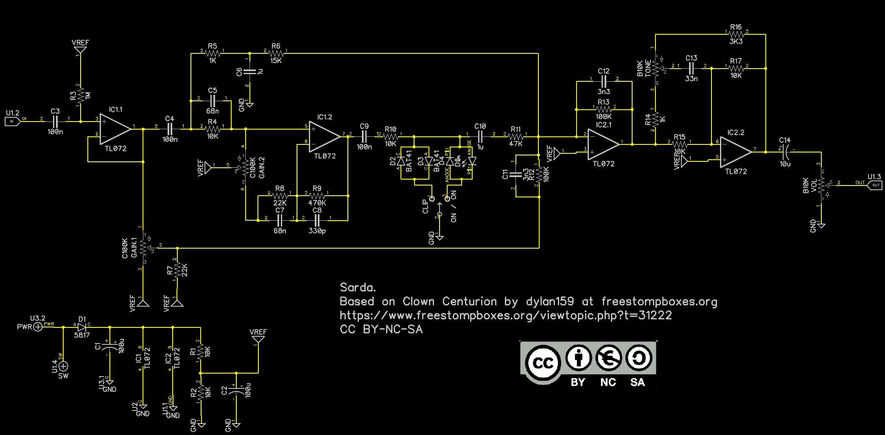
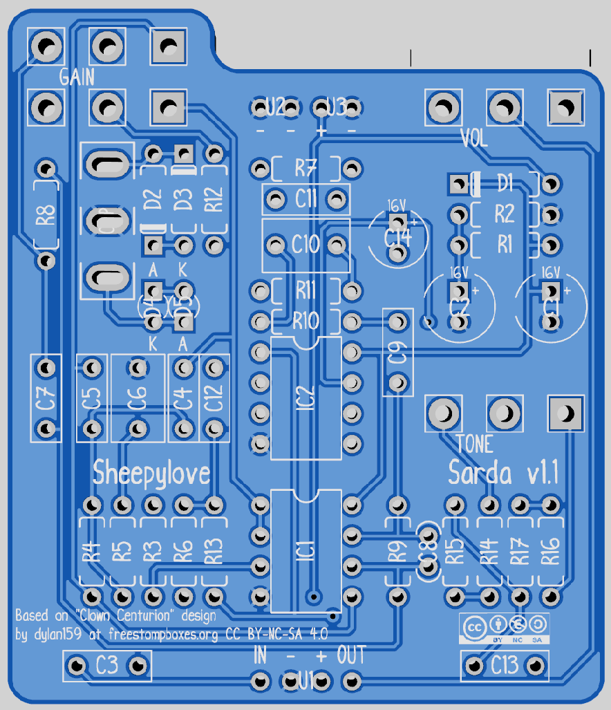
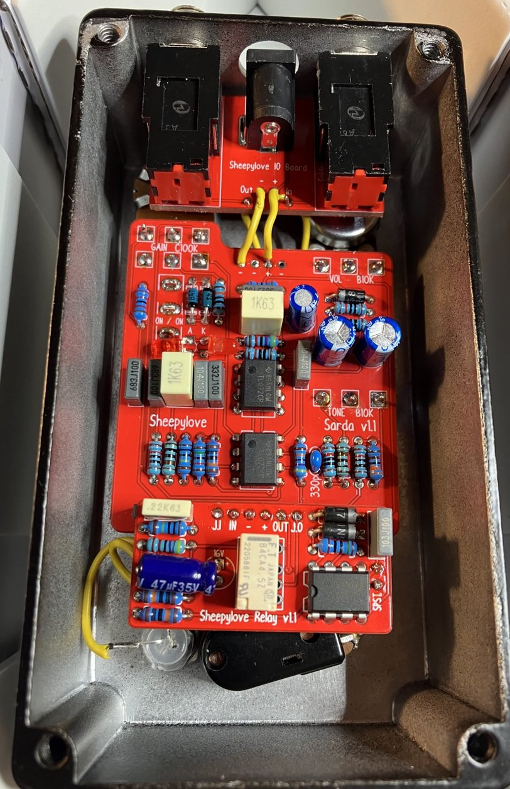

# Sarda
 This work is licensed under a <a rel="license" href="http://creativecommons.org/licenses/by-nc-sa/4.0/">Creative Commons Attribution-NonCommercial-ShareAlike 4.0 International License</a>.

This is based on the Clown Centurian by dylan159 at [www.freestompboxes.org](https://www.freestompboxes.org/viewtopic.php?t=31222).
I have added the option for LED clipping in a "modern" mode. It may give you the impression of a little more bite. Or maybe you want to play with different diodes. I mean, it's just a pedal.

This repository contains:

* A gerber file to produce the PCB.
* A gerber file to produce the PCB with a location specified for the production number if using JLCPCB.
* A gerber file to produce a faceplate with a location specified for the production number if using JLCPCB.
* A schematic.

There is no support supplied or guaranteed for the PCB. I have built it and it works, YMMV.

## Build notes

* There is no on-board LED. Take the positive (+) output at the bottom of the board, connect it to a CLR of your choice (start with 4K7) and then to the LED and from LED to your footswitch. This is documented around the interwebs.

## Images

## About the Sarda sheep

The Sarda is a breed of domestic sheep indigenous to the island of Sardinia.

The Sarda is considered to be among the best Italian breeds of sheep for production of sheep's milk; most of the milk is used to make pecorino sardo cheese.

The Sarda is highly adaptable; it may be kept on lowland or on mountainous terrains, and is suitable both for intensive and for extensive or transhumant management. The long, coarse white wool is used for weaving carpets and other goods.
